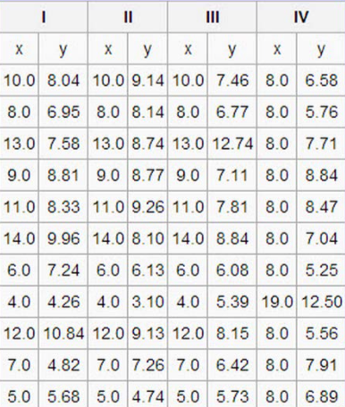

***
##Project Requirements
1. Perform an exploratory data analysis (EDA) on the dataset and draw conclusions
2. Use ggplot2
3. Deliver report in Markdown on RPubs  
  
> Packages used: knitr, dplyr, tidyr, moments, ggplot2, grid, gridExtra
  
##EDA Resources

From the [EDA Wikipedia Page](http://en.wikipedia.org/wiki/Exploratory_data_analysis), the objectives of EDA are:  
1. Suggest hypotheses about the causes of observed phenomena  
2. Assess assumptions on which statistical inference will be based  
3. Support the selection of appropriate statistical tools and techniques  
4. Provide a basis for further data collection through surveys or experiments  

I relied on [*Experimental Design for Behavioral and Social Sciences, Ch. 4, EDA (Seltman, H; 2013)*](http://www.stat.cmu.edu/~hseltman/309/Book/) for guidance on the statistical underpinnings of EDA. I referenced [Tutorial 3: Graphics and Exploratory Data Analysis in R (Piennar, J. and Miller, T.; 2013)](http://bio.fsu.edu/miller/docs/Tutorials/Tutorial3_Graphics.pdf) and [Introduction to R and Exploratory data analysis (Simpson, G; 2006)](http://cc.oulu.fi/~jarioksa/opetus/metodi/eda.pdf) for R-specific EDA techniques. 

##Data Preparation

The data for this project were provided in a PDF. So, I performed the following steps to prepare it for loading into R.  
1. Created a screenshot (data_table.png) of the table only.    
2. Uploaded the screenshot image to Online OCR http://www.onlineocr.net/  
3. Converted data table using Online OCR to a MS Excel .xlsx file  
4. Spot-checked the data and fixed one error where the OCR read an "8" as "a"  
5. Saved the data as 'OCR_data_table.csv'    
**data_table.png**  
   
This method worked well for this small image. A privately hosted or desktop OCR solution would be better if the data needs to be kept private. Additional QA/QC would be required for a larger dataset. 

```{r, echo=FALSE, warning=FALSE, error=FALSE, message=FALSE}
library(dplyr)
library(tidyr)
library(knitr)
library(ggplot2)
```
```{r}
input <- read.csv("OCR_data_table.csv", skip = 1)
DF.1 <-data.frame(input[1:2])
colnames(DF.1) <-c("x", "y")
DF.2 <-data.frame(input[3:4])
colnames(DF.2) <-c("x", "y")
DF.3 <-data.frame(input[5:6])
colnames(DF.3) <-c("x", "y")
DF.4 <-data.frame(input[7:8])
colnames(DF.4) <-c("x", "y")

DF.all<- cbind(DF.1, DF.2, DF.3, DF.4)
```
***
#SECTION 1 - Univariate and Bivariate Analysis
***
##Dataframe 1 - "I"
### Univariate Summary Statistics and Non-graphical EDA (1)
**Summary Statistics**
Both parameters in DF.1 are numeric variables. Their summary statistics are:
```{r}
kable(summary(DF.1), digits = 2, caption = "Summary Statistics for X and Y")
```

X and Y have a similar range, with a lower bound of approximately 4 and an upper bound of approximately 14 and 10, respectively. The central tendency of the two parameters diverge by approximately 1.5 units with x being the larger mean (9 and 7.5, respectively). For both x and y the median and mean are the same or equal, indicating a symmetrical distribution. 

```{r}
sd1.x <- sd(DF.1$x)
sd1.y <- sd(DF.1$y) 
kable(data.frame(sd1.x, sd1.y), digits = 2, col.names = c("X", "Y"), caption = "Standard deviations for X and Y from DF.1", align = "c")
```  
  
The dispersion of the two parameters as indicated by the standard deviation is SD(x) = 3.3 units and SD(y) = 2.0 units.   

**IQR - Interquartile Range**

As stated in Seltman, 2013: *"The IQR is a more robust measure of spread than the variance or standard deviation. Any number of values in the top or bottom quarters of the data can be moved any distance from the median without affecting the IQR at all. More practically, a few extreme outliers have little or no effect on the IQR."* The IQC for DF.1 is:
```{r}
IQR1.x <- quantile(DF.1$x)[4] - quantile(DF.1$x)[2]
IQR1.y <- quantile(DF.1$y)[4] - quantile(DF.1$y)[2]
kable(data.frame(IQR1.x, IQR1.y), col.names = c("X", "Y"), caption = "Interquartile ranges for X and Y from DF.1", align = "c", row.names = FALSE)
```

Like the standard deviation, this shows more spread in the x parameter than y. 

**Skewedness and Krutosis**
While the comparison of mean and median indicated the distributions of x and y would have little to no skew, I calculate it here to be comprehensive. Kurtosis measures the "peakedness" of the distribution relative to the Gaussian distribution. 
```{r, warning=FALSE}
library(moments)

sk1.x <- skewness(DF.1$x)
k1.x <- kurtosis(DF.1$x) 
sk1.y <- skewness(DF.1$y)
k1.y <- kurtosis(DF.1$y)
kable(data.frame(IQR1.x, IQR1.y), col.names = c("X", "Y"), caption = "Skewness for X and Y from DF.1", align = "c")
kable(data.frame(IQR1.x, IQR1.y), col.names = c("X", "Y"), caption = "Kurtosis for X and Y from DF.1", align = "c")
```
  
Both measures of kurtosis are less than 3, indicating platykurtic distributions less peaked than a Gaussian distribution. 

###Bivariate Non-Graphical EDA (1)
Here I investigate the two variables x and y together using non-graphical techniques.   
**Covariance and Correlation**
```{r}
cov1 <- cov(DF.1)
cor1 <- cor(DF.1)
kable(data.frame(IQR1.x, IQR1.y), col.names = c("Covariance of X,Y", "Correlation of X, Y"), caption = "Correlation and Covariance for X and Y from DF.1", align = "c")
```

The covariance between x and y is 5.5. This positive covariance values suggest that when one measurement is above the mean the other will probably also be above the mean, and vice versa. The correlation between x and y is 0.82, indicating a somewhat strong positive correlation between the two variables. 

### Graphical EDA (1)
This EDA uses my own "house theme". The default graphic theme for ggplot2 works great, but by incorporating your own theme you can make it easier to identify and place your own work.   
**Jim's House Theme**
```{r}
#Jim's House Theme
JHT <-function(){
  color.plot.area = "ivory"
  color.background = "white"
  color.grid.major = "black"
  color.axis.text = "gray29"
  color.axis.title = "gray29"
  color.title = "gray29"
  
  theme_bw(base_size=9) +
    theme(panel.background=element_rect(fill=color.plot.area, color=color.plot.area)) +
    theme(plot.background=element_rect(fill=color.background, color=color.background)) +
    theme(panel.border=element_rect(color="gray20", size = 0.15)) +
    theme(panel.grid.major=element_line(color=color.grid.major,size=.25, 
                                        linetype = "longdash")) + 
    theme(axis.line = element_line(color=color.grid.major, size = .5))+
    theme(panel.grid.minor=element_blank()) +
    theme(plot.title=element_text(color=color.title, size=10)) +
    theme(axis.text.x=element_text(size=12,color=color.axis.text)) +
    theme(axis.text.y=element_text(size=12,color=color.axis.text)) +
    theme(axis.title.x=element_text(size=14,color=color.axis.title, face = "bold")) +
    theme(axis.title.y=element_text(size=14,color=color.axis.title, face = "bold")) 
}
```
**Histogram for x and y**
```{r, warning=FALSE, message=FALSE}
library(gridExtra)
library(grid)
#Placing the graphics in a function allows me to make changes later on without needed to update several sections of code
hist.plot <- function(data){
 x <- ggplot(data = data, aes(x = x)) + geom_histogram(binwidth = 1) +JHT() +geom_density(color = "red") + ggtitle("Histogram for X")
 y <- ggplot(data = data, aes(x = y)) + geom_histogram(binwidth = 1) +JHT() +geom_density(color = "red") + ggtitle("Histogram for Y")
 grid.arrange(x, y, ncol=2) 
}
hist.plot(DF.1)
```

The histogram for x shows a uniform distribution. This is characteristic of a independent variable that represents a uniform measurement scale. 

**Scatterplot for DF.1**

In EDA for a bivariate dataset a scatterplot will show the relationship between the two variables.
```{r}
scatter.plot<- function(data){
  ggplot(data = data, aes(x = x, y = y)) +geom_point() +JHT() + geom_smooth(method="lm", color="red", linetype=2) + geom_rug() + ggtitle("Scatterplot")
}
scatter.plot(DF.1)
```

X and y are reasonably well modeled with a linear regression.   

##Dataframe 2 - "II"
###Summary Statistics and Non-graphical EDA (2)

**Summary Statistics**
Both parameters in DF.2 are numeric variables. Their summary statistics are:
```{r, echo=FALSE}
kable(summary(DF.2), digits = 2, caption = "Summary Statistics for X and Y")
```

X ranges from 4 to 14 and is uniformly distributed. Y ranges from 3.1 to 9.26 and has a mean of 7.5. This is lower than the median (8.14). 

** Interquartile Range, Skewness, and Kurtosis**

```{r, echo=FALSE}
sd.x <- sd(DF.2$x)
sd.y <- sd(DF.2$y)
IQR1.x <- quantile(DF.2$x)[4] - quantile(DF.2$x)[2]
IQR1.y <- quantile(DF.2$y)[4] - quantile(DF.2$y)[2]
skewness.x <- skewness(DF.2$x)
krutosis.x <- kurtosis(DF.2$x) 
skewness.y <- skewness(DF.2$y)
kurtosis.y <- kurtosis(DF.2$y)
stats2 <-data.frame(rbind(sd.x, IQR1.x,  skewness.x, krutosis.x), rbind(sd.y, IQR1.y, skewness.y, kurtosis.y))
row.names(stats2) <- c("Standard Deviation", "IQR", "Skewness", "Kurtosis")
kable(stats2, caption="Standard Deviation, IQR, Skewness, and Kurtosis for X, Y")
```

The differences between the mean and median suggested a negative skew in the y variable. This is further shown by a skewness of -1.29. X is uniformly distributed. The kurtosis of y indicate a peak very similar to a Gaussian distribution. 

###Bivariate Non-Graphical EDA (2)
**Covariance and Correlation**
```{r, echo=FALSE, warning=FALSE}
CC2 <- data.frame(rbind(cov(DF.2), cor(DF.2)))
row.names(CC2) <-c("Covariance X", "Covariance Y", "Correlation X", "Correlation Y")
kable(CC2)
```

The covariance between x and y is 5.5. This positive covariance values suggest that when one measurement is above the mean the other will probably also be above the mean, and vice versa. The correlation between x and y is 0.82, indicating a somewhat strong positive correlation between the two variables. 

### Graphical EDA (2)

**Histogram for x and y**  
```{r, echo=FALSE}
hist.plot(DF.2)
```
  
The histogram for x shows a uniform distribution. This is characteristic of an independent variable that represents a uniform measurement scale. 

**Scatterplot for DF.2**

In EDA for a bivariate dataset a scatterplot will show the relationship between the two variables.
```{r, echo=FALSE}
scatter.plot(DF.2)
```

The scatterplot reveals a pattern in the data that is modeled best with a second degree polynomial. 

```{r}
ggplot(data = DF.2, aes(x = x, y = y)) +geom_point() +JHT() + stat_smooth(method="lm", formula = y ~ poly(x, 2), color="red", linetype=2) + geom_rug() + ggtitle("Scatterplot")
```


##Dataframe 3 - "III"
###Summary Statistics and Non-graphical EDA (3)

**Summary Statistics**
Both parameters in DF.3 are numeric variables. Their summary statistics are:
```{r, echo=FALSE}
kable(summary(DF.3), digits = 2, caption = "Summary Statistics for X and Y")
```

X ranges from 4 to 14 and is uniformly distributed. Y has a mean of 7.5 and a median of 7.1, a difference of only 0.4 units, indicating a fairly symetrical distribution. 

** Interquartile Range, Skewness, and Kurtosis**

```{r, echo=FALSE}
sd3.x <- sd(DF.3$x)
sd3.y <- sd(DF.3$y)
IQR3.x <- quantile(DF.3$x)[4] - quantile(DF.3$x)[2]
IQR3.y <- quantile(DF.3$y)[4] - quantile(DF.3$y)[2]
skewness3.x <- skewness(DF.3$x)
krutosis3.x <- kurtosis(DF.3$x) 
skewness3.y <- skewness(DF.3$y)
kurtosis3.y <- kurtosis(DF.3$y)
stats3 <-data.frame(rbind(sd3.x, IQR3.x,  skewness3.x, krutosis3.x), rbind(sd3.y, IQR3.y, skewness3.y, kurtosis3.y))
row.names(stats3) <- c("Standard Deviation", "IQR", "Skewness", "Kurtosis")
kable(stats3, caption="Standard Deviation, IQR, Skewness, and Kurtosis for X, Y")
```

Y is positively skewed with a skewness of 1.59. The kurtosis of y indicates a more peaked distribution compared to a Gaussian distribution. 

###Bivariate Non-Graphical EDA (3)  
**Covariance and Correlation**
```{r, echo=FALSE, warning=FALSE}
CC3 <- data.frame(rbind(cov(DF.3), cor(DF.3)))
row.names(CC3) <-c("Covariance X", "Covariance Y", "Correlation X", "Correlation Y")
kable(CC3)
```

The covariance between x and y is 5.5. This positive covariance values suggest that when one measurement is above the mean the other will probably also be above the mean, and vice versa. The correlation between x and y is 0.82, indicating a somewhat strong positive correlation between the two variables. 

### Graphical EDA (3)

**Histogram for x and y**  
```{r, echo=FALSE}
hist.plot(DF.3)
```
  
**Scatterplot**

In EDA for a bivariate dataset a scatterplot will show the relationship between the two variables.
```{r, echo=FALSE}
scatter.plot(DF.3)
```

DF3 appears to have an outlying observation at x = 13. The rest of the data would be very well modeled with a linear regressing if this data point is eliminated. However, I would not immediately throw out the measurement at x = 13. If possible I would investigate the source of the data to determine if it can be explained. 

##Dataframe 4 - "IV"
###Summary Statistics and Non-graphical EDA

**Summary Statistics**
Both parameters in DF.4 are numeric variables. Their summary statistics are:
```{r, echo=FALSE}
kable(summary(DF.4), digits = 2, caption = "Summary Statistics for X and Y")
```

X ranges from 8 to 19. The it's mean and median vary by 1, both measures are very close to the minimum indicating a strong positive skew. Y ranges from 5.25 to 12.5 and has a mean of 7.5, which is close to it's median of 7. 

** Interquartile Range, Skewness, and Kurtosis**

```{r, echo=FALSE}
sd4.x <- sd(DF.4$x)
sd4.y <- sd(DF.4$y)
IQR4.x <- quantile(DF.4$x)[4] - quantile(DF.4$x)[2]
IQR4.y <- quantile(DF.4$y)[4] - quantile(DF.4$y)[2]
skewness4.x <- skewness(DF.4$x)
krutosis4.x <- kurtosis(DF.4$x) 
skewness4.y <- skewness(DF.4$y)
kurtosis4.y <- kurtosis(DF.4$y)
stats4 <-data.frame(rbind(sd4.x, IQR4.x,  skewness4.x, krutosis4.x), rbind(sd4.y, IQR4.y, skewness4.y, kurtosis4.y))
row.names(stats4) <- c("Standard Deviation", "IQR", "Skewness", "Kurtosis")
kable(stats4, caption="Standard Deviation, IQR, Skewness, and Kurtosis for X, Y")
```

Y exhibits a skewness of 1.3 and a kurtosis of 4.4. These indicate a distribution more peaked than Gaussian and with a positive skew. For x the IQR is zero. Further investigation reveals that the observations for x are nearly all 8.0, with a single measurement of 19. This is a stong indication that this measurement is an outlier. Unlike in DF.3, it would be best to eliminate this data point from consideration because the rest of the observations are uniform.
```{r}
DF.4.mod <- filter(DF.4, x == 8)
```


###Bivariate Non-Graphical EDA  (4)
**Covariance and Correlation**
```{r, echo=FALSE, warning=FALSE}
CC4 <- data.frame(rbind(cov(DF.4.mod), cor(DF.4)))
row.names(CC4) <-c("Covariance X", "Covariance Y", "Correlation X", "Correlation Y")
kable(CC4)
```

Eliminating the outlier at x = 19 creates a equal set where all x = 8. Therefore, the variable x has no variation and no ability to explain the variation in y. 

### Graphical EDA (4)

**Histogram for x and y**  
```{r, echo=FALSE}
hist.plot(DF.4.mod)
```
  
As 

**Scatterplot**
A scatterplot is not appropriate for DF.4 as all observations of x = 8. 


***
# SECTION 2 - COMPARISONS AND CONCLUSIONS 
***
**Correlation of X and Y**
```{r}
cor.all <- rbind(cor(DF.1)[2], cor(DF.2)[2], cor(DF.3)[2], cor(DF.4)[2])
row.names(cor.all) <- c("DF.1", "DF.2", "DF.3", "DF.4")
kable(data.frame(cor.all), digits = 2, col.names = c("Correlation"), caption = "X,Y correlations", align = "c")
```

Note that despite four very different distributions in the y variable, the correlation of each dataset's x and y variable is 0.82. The big takeaway is that a taking multiple EDA approaches, including graphic and non-graphic techniques, is necissary to avoid analysis errors in the case of coincidences or patterns. There's no single "silver bullet" technique that always produces useful information. 


